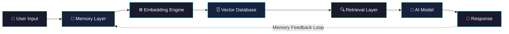

<div align="center">

# RecallOS

### The Memory Layer for AI

Give your AI agents, copilots, and applications the ability to **remember everything**.

[](https://opensource.org/licenses/MIT)
[](https://github.com/recallos636/recall-core-memory/pulls)
[](https://github.com/recallos636/recall-core-memory)
[](https://www.npmjs.com/package/recallos)

[Website](https://recallos.dev) · [Documentation](https://docs.recallos.dev) · [Discord](https://discord.gg/recallos) · [Twitter](https://twitter.com/recallos_dev)

</div>

---

## Overview

AI has an **amnesia problem**. Every conversation starts from zero. Your users repeat themselves. Your agents forget critical context. Your copilots lose track of decisions made five minutes ago.

**RecallOS fixes this.**

RecallOS is persistent memory infrastructure for AI agents, copilots, and applications. It provides a unified memory layer that lets any AI system store, retrieve, and reason over past interactions — across sessions, across models, across your entire stack.

> **Think of RecallOS as the hippocampus for your AI.** It transforms stateless AI into systems that learn, adapt, and remember.

```
Without RecallOS:  User → AI → Response (context lost forever)
With RecallOS:     User → AI → Memory Layer → Response (every insight persists)
```

### Why RecallOS?

- **Users hate repeating themselves.** RecallOS gives your AI full conversational continuity.
- **Agents need context to reason.** Long-running agents lose effectiveness without memory. RecallOS keeps them sharp.
- **Privacy shouldn't be an afterthought.** Your memory layer should be open, auditable, and under your control.

---

## Key Features

| | Feature | Description |
|---|---|---|
| 🧠 | **Persistent Memory** | Store and recall memories across sessions, restarts, and deployments. Nothing is lost. |
| 🔍 | **Semantic Search** | Find relevant memories by meaning, not just keywords. Sub-50ms retrieval at scale. |
| 📦 | **Memory Collections** | Organize memories into logical collections — per user, per project, per agent. |
| 🔄 | **Cross-Session Recall** | Seamlessly continue conversations days, weeks, or months later with full context. |
| ⚡ | **Vector Retrieval** | Built on optimized vector storage for lightning-fast similarity search over millions of memories. |
| 🤖 | **AI Integrations** | First-class support for Claude, GPT, Gemini, DeepSeek, Llama, and more. |
| 🏗️ | **Open Architecture** | Fully extensible. Bring your own embeddings, storage backend, or retrieval strategy. |
| 🔒 | **Privacy-First** | Your data stays yours. Self-host, encrypt, and audit everything. No vendor lock-in. |

---

## Architecture



RecallOS sits between your application and your AI model, transparently enriching every interaction with relevant memory. The feedback loop ensures that every response generates new memories, creating a continuously improving system.

---

## Quick Start

Get up and running in under 60 seconds.

### 1. Install RecallOS

```bash
pip install recallos
```

### 2. Initialize your project

```bash
recallos init
```

### 3. Create your first memory collection

```bash
recallos memory create --collection my_project
```

> **That's it.** You now have a fully functional memory layer ready to integrate with any AI model.

---

## Usage Examples

### Initialize the Client

```python
from recallos import RecallClient

# Connect to your RecallOS instance
client = RecallClient(
    api_key="your-api-key",
    collection="my_project"
)
```

### Store Memories

```python
# Store a simple memory
client.store(
    content="User prefers dark mode and concise responses.",
    metadata={"type": "preference", "user_id": "user_123"}
)

# Store a conversation memory
client.store(
    content="Discussed migrating the database from PostgreSQL to CockroachDB. "
            "Decision: proceed with migration in Q3.",
    metadata={"type": "decision", "project": "infrastructure"}
)
```

### Retrieve Memories

```python
# Get recent memories for a user
memories = client.retrieve(
    user_id="user_123",
    limit=10
)

for memory in memories:
    print(f"[{memory.timestamp}] {memory.content}")
```

### Semantic Search

```python
# Search by meaning, not keywords
results = client.search(
    query="What database decisions have we made?",
    top_k=5,
    threshold=0.75
)

for result in results:
    print(f"Score: {result.score:.2f} | {result.content}")
```

### Full Integration Example

```python
from recallos import RecallClient
from openai import OpenAI

recall = RecallClient(collection="support_agent")
openai = OpenAI()

def chat(user_id: str, message: str) -> str:
    # Retrieve relevant memories
    context = recall.search(query=message, user_id=user_id, top_k=5)
    memory_context = "\n".join([m.content for m in context])

    # Generate response with memory-augmented context
    response = openai.chat.completions.create(
        model="gpt-4o",
        messages=[
            {"role": "system", "content": f"User context:\n{memory_context}"},
            {"role": "user", "content": message}
        ]
    )

    reply = response.choices[0].message.content

    # Store the interaction as a new memory
    recall.store(
        content=f"User: {message}\nAssistant: {reply}",
        metadata={"user_id": user_id, "type": "conversation"}
    )

    return reply
```

---

## Integrations

RecallOS works with every major AI provider out of the box.

| Provider | Status | Models | Documentation |
|:---------|:------:|:-------|:--------------|
| **OpenAI** | ✅ Supported | GPT-4o, GPT-4, GPT-3.5 | [Guide →](https://docs.recallos.dev/integrations/openai) |
| **Anthropic** | ✅ Supported | Claude 4, Claude 3.5 Sonnet | [Guide →](https://docs.recallos.dev/integrations/anthropic) |
| **Google** | ✅ Supported | Gemini 2.5 Pro, Gemini 2.5 Flash | [Guide →](https://docs.recallos.dev/integrations/google) |
| **DeepSeek** | ✅ Supported | DeepSeek-V3, DeepSeek-R1 | [Guide →](https://docs.recallos.dev/integrations/deepseek) |
| **Qwen** | ✅ Supported | Qwen 2.5, Qwen-Max | [Guide →](https://docs.recallos.dev/integrations/qwen) |
| **Meta** | ✅ Supported | Llama 3.1, Llama 3 | [Guide →](https://docs.recallos.dev/integrations/llama) |
| **Mistral** | ✅ Supported | Mistral Large, Mistral Medium | [Guide →](https://docs.recallos.dev/integrations/mistral) |
| **HuggingFace** | ✅ Supported | Any hosted model | [Guide →](https://docs.recallos.dev/integrations/huggingface) |

> **Don't see your provider?** RecallOS's open architecture means you can integrate any model with a few lines of code. [See the custom integration guide →](https://docs.recallos.dev/integrations/custom)

---

## Roadmap

We're building the future of AI memory in the open. Here's where we're headed:

- [x] Core memory engine
- [x] Semantic search with vector embeddings
- [x] CLI tools for memory management
- [x] Multi-provider AI integrations
- [ ] 🔜 Multi-agent memory sharing
- [ ] 🔜 Memory versioning & time-travel
- [ ] Real-time sync across distributed systems
- [ ] Enterprise SSO & RBAC
- [ ] Memory analytics dashboard
- [ ] Memory compression & summarization
- [ ] Plugin ecosystem

> **Want to influence the roadmap?** [Vote on features](https://github.com/recallos636/recall-core-memory/discussions) or [open an issue](https://github.com/recallos636/recall-core-memory/issues).

---

## Contributing

We welcome contributions from everyone. Whether it's a bug fix, new feature, documentation improvement, or just a typo — every contribution matters.

```bash
# Clone the repo
git clone https://github.com/recallos636/recall-core-memory.git
cd recall-core-memory

# Install dependencies
pip install -e ".[dev]"

# Run tests
pytest

# Run linting
ruff check .
```

Please read our [**Contributing Guide**](CONTRIBUTING.md) and [**Code of Conduct**](CODE_OF_CONDUCT.md) before submitting a PR.

> **First time contributing to open source?** We've tagged issues with `good first issue` to help you get started. [Browse them here →](https://github.com/recallos636/recall-core-memory/issues?q=is%3Aissue+is%3Aopen+label%3A%22good+first+issue%22)

---

## Community

Join the RecallOS community — we'd love to have you.

- 💬 [**Discord**](https://discord.gg/recallos) — Chat with the team and community
- 🐦 [**Twitter / X**](https://twitter.com/recallos_dev) — Follow for updates and announcements
- 💡 [**GitHub Discussions**](https://github.com/recallos636/recall-core-memory/discussions) — Ask questions, share ideas, vote on features
- 🐛 [**Issue Tracker**](https://github.com/recallos636/recall-core-memory/issues) — Report bugs or request features

---

## FAQ

<details>
<summary><b>What makes RecallOS different from just using a vector database?</b></summary>

RecallOS is more than a vector database wrapper. It provides a complete memory management layer — including automatic embedding, memory lifecycle management, collection organization, semantic retrieval with relevance scoring, and native AI model integrations. Think of it as the difference between a hard drive and an operating system.

</details>

<details>
<summary><b>Can I self-host RecallOS?</b></summary>

Absolutely. RecallOS is fully open-source under the MIT license. You can self-host it on your own infrastructure with complete control over your data. We also offer a managed cloud option for teams that prefer not to manage infrastructure.

</details>

<details>
<summary><b>How does RecallOS handle privacy and data security?</b></summary>

Privacy is a core design principle, not an afterthought. All memories are stored in your own infrastructure (or our SOC 2 compliant cloud). We support encryption at rest and in transit, fine-grained access controls, and full audit logging. Your data never leaves your control.

</details>

<details>
<summary><b>What's the performance like at scale?</b></summary>

RecallOS is designed for production workloads. Semantic search returns results in under 50ms even with millions of stored memories. The vector retrieval engine is optimized for high-throughput, concurrent access patterns typical of production AI applications.

</details>

<details>
<summary><b>Does RecallOS work with my existing AI framework?</b></summary>

Yes. RecallOS integrates with LangChain, LlamaIndex, CrewAI, AutoGen, and any framework that supports custom memory backends. If your framework can make API calls, it can use RecallOS. See our [integration guides](https://docs.recallos.dev/integrations) for step-by-step setup.

</details>

<details>
<summary><b>Is RecallOS production-ready?</b></summary>

Yes. RecallOS is used in production by teams building AI copilots, customer support agents, and knowledge management systems. The core memory engine and semantic search have been stable since v1.0, and we follow semantic versioning for all releases.

</details>

---

## License

RecallOS is open-source software licensed under the [MIT License](LICENSE).

```
MIT License — Copyright (c) 2025 RecallOS Contributors
```

---

<div align="center">

**Built with 🧠 by the RecallOS community**

[⬆ Back to top](#recallos)

</div>
